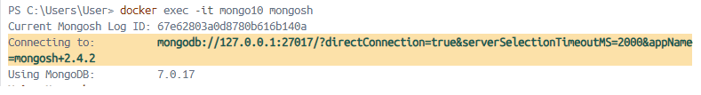
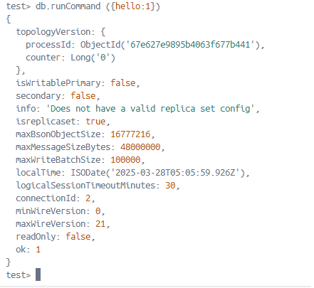
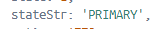
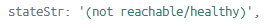
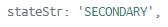
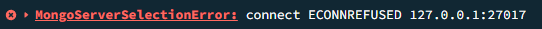
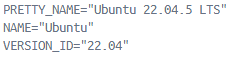
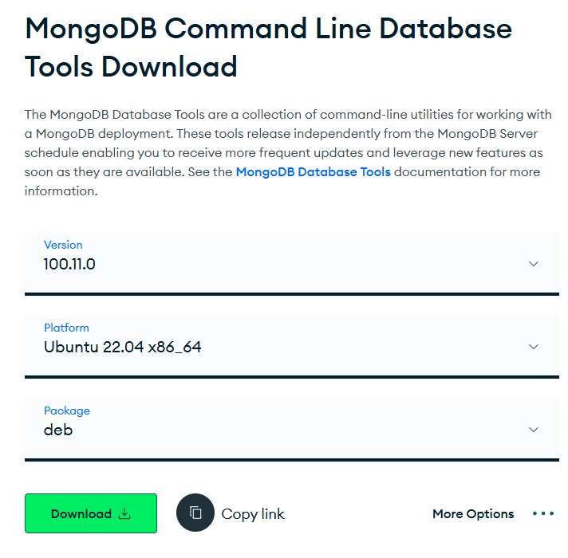

# Criação de um cluster com o Docker e o MongoDB e como fazer o Backup e Restore de um banco de dados no MongoDB

<p -width="100%" align="center">
    
</p>

 

## 📋 Menu

<ul>
  <li><a href="#network">Cluster Replica Set</a></li>
  <ul>
    <li><a href="#nos">Criação dos nós</a></li>
    <li><a href="#replica">Iniciando o Replica Set no Docker</a></li>
    <li><a href="#inserir">Inserindo dados no banco de dados no MongoDB Compass</a></li>
    <li><a href="#nosecundario">Derrubando um nó secundário</a></li>
    <li><a href="#noprimario">Derrubando o nó primário</a></li>
  </ul>
  <li><a href="#backup">Backup e Restore</a></li>
</ul>

<p id="network"></p>

### 💻  Criação do docker network:

<p>
  Para criar o network do cluster você precisará abrir o terminal do docker e inserir o seguinte prompt (mongoCluster é o nome do network):
</p>

```shell
docker network create mongoCluster
```
<p id="nos"></p>

### ⚙️ Criação dos nós:

<p>
  Para criar os nós, ainda no terminal do doker, é necessário inserir o prompt a seguir:
</p>

<p>
  Primeiro nó:
</p>

```shell
docker run -d --rm -p 27017:27017 --name mongo10 --network mongoCluster mongodb/mongodb-community-server:latest --replSet myReplicaSet --bind_ip localhost,mongo10
```
<p>
  27017 é o endereço, mongo10 é o nome do nó (conteiner), mongoCluster é o network sendo utilizado, mongodb/mongodb-community-server:latest é a imagem sendo utilizada, o nome do replica set é myReplicaSet, localhost é onde será hospedado.
</p>

<p>
  Segundo nó:
</p>

```shell
docker run -d --rm -p 27018:27017 --name mongo20 --network mongoCluster mongodb/mongodb-community-server:latest --replSet myReplicaSet --bind_ip localhost,mongo20
```

<p>
  27018 é o endereço, mongo10 é o nome do nó (conteiner), mongoCluster é o network sendo utilizado, mongodb/mongodb-community-server:latest é a imagem sendo utilizada, o nome do replica set é myReplicaSet, localhost é onde será hospedado.
</p>

<p>
  Terceiro nó:
</p>

```shell
docker run -d --rm -p 27019:27017 --name mongo30 --network mongoCluster mongodb/mongodb-community-server:latest --replSet myReplicaSet --bind_ip localhost,mongo30
```

<p>
  27019 é o endereço, mongo10 é o nome do nó (conteiner), mongoCluster é o network sendo utilizado, mongodb/mongodb-community-server:latest é a imagem sendo utilizada, o nome do replica set é myReplicaSet, localhost é onde será hospedado.
</p>

<p>
  Quarto nó:
</p>

```shell
docker run -d --rm -p 27020:27017 --name mongo40 --network mongoCluster mongodb/mongodb-community-server:latest --replSet myReplicaSet --bind_ip localhost,mongo40
```

<p>
  27020 é o endereço, mongo10 é o nome do nó (conteiner), mongoCluster é o network sendo utilizado, mongodb/mongodb-community-server:latest é a imagem sendo utilizada, o nome do replica set é myReplicaSet, localhost é onde será hospedado.
</p>

<p id="replica"></p>

### 🚀 Iniciando o Replica Set no Docker

<p>
  Utilizando o mongosh no docker, ainda no terminal do docker, utilize o prompt:
</p>

```shell
docker exec -it mongo10 mongosh
```

<p>
  docker exec: Esse é o comando principal para executar um processo dentro de um container que já está em execução. O mongo10: Esse é o nome do container no qual você deseja executar o processo. No seu caso, é o container chamado mongo10. O mongosh: É o comando que será executado dentro do container. mongosh é a nova versão do shell interativo do MongoDB, onde você pode rodar comandos MongoDB diretamente. o -it: Esse comando efetivamente abre uma sessão interativa do MongoDB Shell.
</p>

<p>
  Salve o endereço que aparecerá no campo Connection To, por exemplo:
</p>

```
mongodb://127.0.0.1:27017/?directConnection=true&serverSelectionTimeoutMS=2000&appName=mongosh+2.4.2
```

<p -width="100%" align="center">
    
</p>

<p>
  Verifique se o conteiner está executando com o seguinte prompt:
</p>

```shell
db.runCommand ({hello:1})
```

<p -width="100%" align="center">
    
</p>

<p>
  Ainda no docker, faça a configuração do replica set dos nós e os ative, inserindo o id de cada um e qual o id do replica set, mostrando qual o membro também, usando o prompt:
</p>

```shell
rs.initiate ({ _id: "myReplicaSet", members:[{_id:0, host: "mongo10"}, {_id:1, host: "mongo20"}, {_id:3, host: "mongo30"}, {_id:4, host: "mongo40"}]})
```

<p>Saia do MongoDB Shell:</p>

```shell
exit
```

<p>
  Verifique o status do cluster e verifique quem é o nó primário:
</p>

```shell
docker exec -it mongo10 mongosh --eval "rs.status()"
```

<p -width="100%" align="center">
    
</p>

<p>
  Você pode usar esse comando em outro nó que foi configurado também, como por exemplo o mongo20. E verifique quem é o nó primário.
</p>

<p id="inserir"></p>

### ➕ Inserindo dados no banco de dados no MongoDB

<p>
  Abra o MongoDB Compass, e adicione uma nova conexão, utilize o endereço que foi salvo, e preste atenção em quem é o nó primario, exemplo do nó primário como mongo10 (se fosse o mongo20, você troca o 27017 por 27018, como foi programado anteriormente):
</p>

```
mongodb://127.0.0.1:27017/?directConnection=true&serverSelectionTimeoutMS=2000&appName=mongosh+2.4.2
```

Abra o terminal e verifique se o seu terminal está da seguinte forma:

```
myReplicaSet [direct: primary] test>
```

<p>
  Verifique qual o nó que você está conectado, inserindo o seguinte prompt:
</p>

```shell
rs.isMaster().primary
```

<p>Criação do banco de dados e inserção dos dados</p>

```shell
use ClusterMongo

db.cliente.insertOne({codigo:1, nome: "Marcos"});

db.cliente.insertOne({codigo:2, nome: "Gabriel"});

db.cliente.insertOne({codigo:3, nome: "Eric"});

db.cliente.insertOne({codigo:4, nome: "Ana"});

db.cliente.insertOne({codigo:5, nome: "Juliana"});

```

<p>
  Verifique se os dados foram inseridos.
</p>

```
db.cliente.find()
```

<p id="nosecundario"></p>

### 💥 Derrubando um nó secundário:

<p>
  Foi escolhido o nó mongo40 para derrubar, no terminal do docker digite: 
</p>

```shell
docker stop mongo40
```

<p>
  Você irá verificar que o conteiner do mongo40 desapareceu. Para confirmar digite no terminal:
</p>

```shell
docker exec -it mongo10 mongosh --eval "rs.status()"
```

<p>
  Você verificará que onde deveria estar indicando secundary, está dizendo que o nó não está saudável.
</p>

<p -width="100%" align="center">
    
</p>

<p>
  No MongoDB Compass, adicione um dado. E você verificará que o cluster ainda está funcionando normalmente. Exemplo:
</p>

```shell
db.cliente.insertOne({codigo:8, nome: "João"});
```

<p>
  Para restabelecer o nó, utilize o seguinte prompt (lembrando que foi o mongo40 que foi derrubado):
</p>

```shell
docker run -d --rm -p 27020:27017 --name mongo40 --network mongoCluster mongodb/mongodb-community-server:latest --replSet myReplicaSet --bind_ip localhost,mongo40
```

<p>
  Verifique o status do nó com o prompt abaixo:
</p>

```shell
docker exec -it mongo10 mongosh --eval "rs.status()"
```

<p>
    Aparecerá como secundário novamente.
</p>

<p>
  Você verificará que o nó voltou e está ativo como secundário.
</p>

<p -width="100%" align="center">
    
</p>

<p id="noprimario"></p>

### 🔄 Derrubando o nó primário:

<p>
    No docker, para parar um nó primário (no meu caso o mongo10), digite o seguinte prompt:
</p>

```shell
docker stop mongo10
```

<p>
    Para verificar, entre fazendo o acesso por outro nó (no meu caso usei o mongo20), usando o seguinte prompt:
</p>

```shell
docker exec -it mongo20 mongosh --eval "rs.status()"
```

<p>
    Você verificará que o nó não está saudável, onde deveria estar escrito primary.
</p>

<p -width="100%" align="center">
    
</p>

<p>
    Encontre o nó primário para poder fazer a conexão posteriormente.
</p>

<p -width="100%" align="center">
    
</p>

<p>
    No MongoDB Compass tente inserir um dado. Por exemplo:
</p>

```shell
db.cliente.insertOne({codigo:6, nome: "José"});
```

<p>
    Irá aparecer um erro, devido ao nó estar desconectado.
</p>

<p -width="100%" align="center">
    
</p>

<p>
    Faça uma nova conexão no MongoDB compass com o novo nó primário, verifique que somente o endereço referente ao nó foi alterado no link de conexão (no meu caso o primário é o mongo30 dessa vez):
</p>

```shell
mongodb://127.0.0.1:27019/?directConnection=true&serverSelectionTimeoutMS=2000&appName=mongosh+2.4.2
```

<p>
    Faça a leitura e inserção de dados para teste:
</p>

```shell
use ClusterMongo

db.cliente.find()

db.cliente.insertOne({codigo:7, nome: "Matheus"});
```

<p>
    No docker, volte com o nó anteriormente derrubado, usando o prompt:
</p>

```shell
docker run -d --rm -p 27017:27017 --name mongo10 --network mongoCluster mongodb/mongodb-community-server:latest --replSet myReplicaSet --bind_ip localhost,mongo10
```

<p>
    Verifique o nó mongo10 voltou como secundário e está funcionando.
</p>

```shell
docker exec -it mongo20 mongosh --eval "rs.status()"
```

<p -width="100%" align="center">
    
</p>

<p>
    Assim foi feito a derrubada de um nó secundário e o primário, e o cluster continuou trabalhando normalmente.
</p>

<p id="backup"></p>

### 💾 Backup e Restore

<p>
    Primeiramente é necessário instalar a ferramenta Command Line do MongoDB. E para isso é preciso verificaro o Sistema Operacional do conteiner que será instalado o Command Line. E para isso acesse o docker, no meu caso farei no conteiner mongo30. Execute o comando a seguir para entrar no bash do conteiner:
</p>

```shell
docker exec -it mongo30 bash
```

<p>
    Execute o comando a seguir para verificar o Sistema Operacional do conteiner:
</p>

```shell
cat /etc/os-release
```
<p>
    No meu caso é o Ubunto 22.04.
</p>

<p -width="100%" align="center">
    
</p>

<p>
    Será necessário instalar o Command Line no conteiner, agora que você vai até a página para o download e selecione o Sistema Operacional correto  e marque como package "deb". E faça o download.
</p>

🔗[Link do site para download do Command Line](https://www.mongodb.com/try/download/database-tools)

<p -width="100%" align="center">
    
</p>

<p>
    No docker, você precisará inserir o arquivo que você baixou dentro do conteiner. E para isso insira o prompt abaixo (lembrando que o caminho do arquivo pode mudar):
</p>

```shell
docker cp "C:\CommandLine\mongodb-database-tools-ubuntu2204-x86_64-100.11.0.deb" mongo30:/tmp
```

<p>
    Acesse o bash do conteiner usando o comando abaixo (lembrando que estou usando o mongo30):
</p>

```shell
docker container exec -u 0 -it mongo30 bash
```

<p>
    Como foi adicionado o arquivo dentro da pasta tmp, acesse a pasta tmp:
</p>

```shell
cd tmp
```

<p>
    Verifique se o arquivo está na pasta.
</p>

```shell
ls
```

<p>
    Faça a instalação da ferramenta com o prompt abaixo:
</p>

```shell
dpkg -i mongodb-database-tools-ubuntu2204-x86_64-100.11.0.deb
```

<p>
    Após a instalação da ferramenta, saia da pasta:
</p>

```shell
cd ..
```

<p>
    Nesse ponto, será feito o backup full dos bancos de dados. Utilize o prompt:
</p>

```shell
mongodump
```

<p>
    Acesse a pasta dump, onde haverá os arquivos de backup dos bancos de dados.
</p>

```shell
cd dump
```

<p>
    Verifique se foi criado os arquivos:
</p>

```shell
ls
```

<p>
    Saia da pasta dump:
</p>

```shell
cd ..
```

<p>
    Delete o banco de dados que você deseja fazer o teste, no meu caso deletei o banco de dados ClusterMongo. Após deletar volte no docker ainda no bash como root, e digite:
</p>

```shell
mongorestore --nsInclude=ClusterMongo.* dump/
```

<p>
    Verifique que o banco foi restaurado com sucesso, no MongoDB Compass, usando o banco ClusterMongo, use o find para verificar os dados:
</p>

```shell
db.cliente.find()
```

<p>
    Você verificará que os dados voltaram.
</p>

